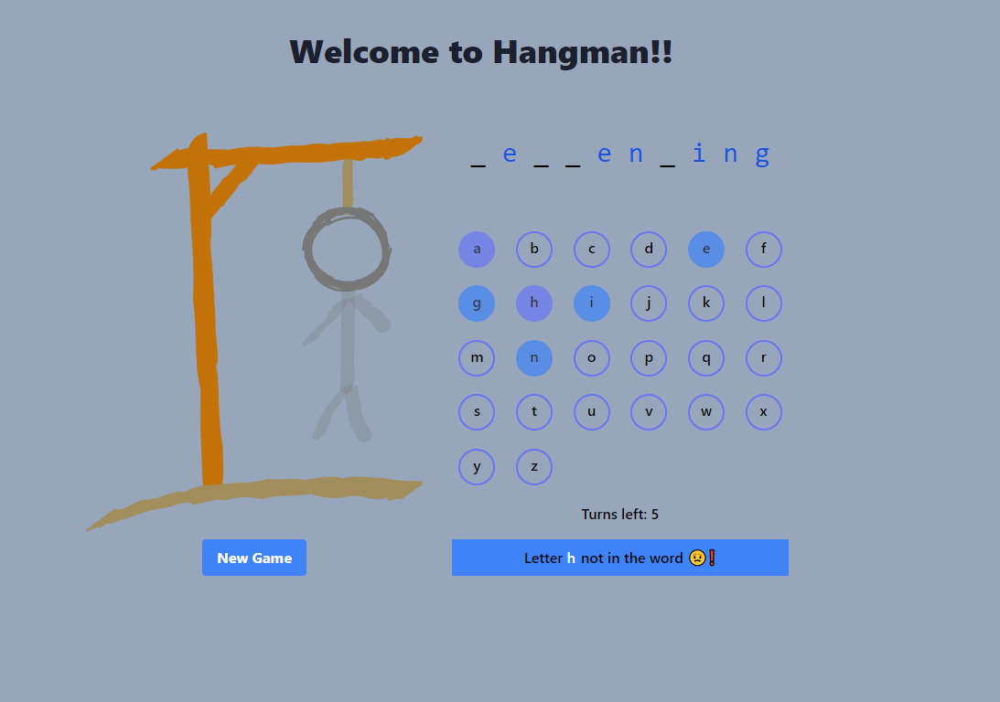

# Hangman LiveView Client

LiveView client for the _Hangman Game_.

##### Based on the course [Elixir for Programmers](https://codestool.coding-gnome.com/courses/elixir-for-programmers) by Dave Thomas.

## Usage

To use `Hangman LiveView Client` locally, clone and compile it:

  - `git clone https://github.com/RaymondLoranger/hangman_liveview_client`
  - `cd hangman_liveview_client`
  - `mix deps.get`
  - `mix phx.server`

Now you can visit [`localhost:4000`](http://localhost:4000) from your browser.

## Game in progress

## 